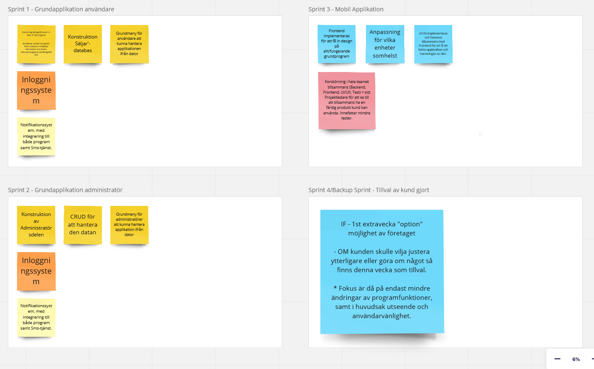
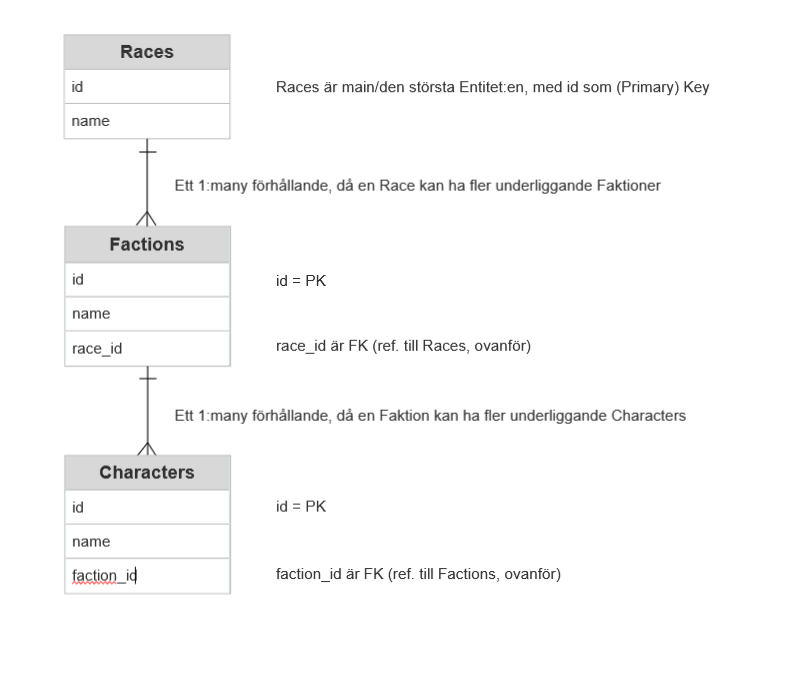

# Scrumplanering i praktiken - Utmaning

## Cristoffer Östberg

## 1. Produktvision 

Games Workshop behöver ett nytt inventariehanteringssystem för sina olika karaktärsklasser (IRL).  
Karaktärerna de har är:

- Space Marines,   
- Imperial Guard,  
- Chaos Space Marines,  
- Tyranids,  
- Necrons,  
- Eldar,  
- Tau, och  
- Orks.

Varje karaktärsklass kan i sig sedan ha fler underklasser med olika faktioner.

Games Workshop och Utvecklingsteamet har tillsammans beslutat sig för att de vill använda sig av MongoDB, som databaslösning. De vill använda CRUD in och ur inventariehanteringen/lagersaldo.  
De vill ha ett stabilt och pålitligt (simpelt) system, i en ändå snygg design som både de anställda i butiker kan använda samt ledningskontor. Ligger server nere skall den kunna lagras lokalt på deras egna server så länge.

* Steg 1 är att utveckla programdelen i sig för användare.
* Steg 2 är sedan

    --> när första steget är klart: 

beroende på hur det första steget gick: Ej drar ut på tid eller kostnad för mycket, då kan de avbryta.   
    	- Detta har kund satt som en säkring/extratillägg för att se att vi verkligen är det fantastiska företag och team vi utger oss för att vara. 
            De letar just denna gång efter en riktig kvalitetsprodukt.
    
    --> utveckla programdelen för administratör.

* Steg 3 är utveckla mobilapplikation vid teknikkrångel när de tidvis inte har tillgång till en fast dator tex och implementera UI/UX. Samt tester. De har även lagt till
* Steg 4 vilket är ett tillval av extratester och mer genomgående review och feedback ifrån deras sida vad som kan ändras och implementeras och göras bättre på 1 veckas extra tillval-Sprint.  

Programmet kommer bestå av en huvuddatabas med mindre collections i sig som kommer innefatta de olika karaktärsklasserna, och i varje dokument kommer mer detaljerad information om varje enhet med faktionstillhörighet finnas.

## 2. Produktbacklog 

#### Användare:

* CRUD allmänt för att kunna hantera samtliga karaktärsklasser samt underklasser.  
    För att söka på olika parametrar (Karaktärsklass, Faktion, Enhet) så finns det fler metoder där du till exempel kan söka på bara en eller fler av de parametrarna.  
     

* För lagerhantering kommer det finnas en aviserings/notifikationsfunktion som notifierar i programmet samt integreras med en sms-tjänst då saldot börjar närma sig 100 enheter per Karaktär.  
    Du kan både få ut en lista med hur det ser ut med lagersaldo för individuell Faktion, eller en total lista för samtliga faktioner i ett enda långt dokument. 
     

* Tillägg i användarKlassen är att: När säljaren gör en beställning/lägger till något ifrån databasen (En karaktär) finns en stor vertikal TV-skärm på sidan som visar just den huvudkaraktärsklassen + faktionen i en “live-video-stance” när den står upp på skärmen i aktion, som i en “rullande GIF- eller kortare video-sekvens". Detta hämtas ifrån en separat video i resourceKlass. 

#### Administratör:

* För att få en lista med lagersaldo använder den samma funktion som användaren med att Read:a den funktionen. 

* När man tar ut eller Delete:ar en produkt ifrån databasen ‘Produkter’ (Integreras/synkroniseras direkt i funktionen i programmet som säljaren står och hanterar på valfri enhet) skall man ange anledning varför, och som sparas i listor i en separat databas ‘Hantering’. Där anger man tex om:  

    * Varan är defekt ifrån produktion, skall kasseras eller returneras 
    * Såld 

* Dessa försäljningsrapporter kan man sedan ta del av i en funktion ifrån meny nr 2.
* För att ta del av dessa rapporter (och hålla det mer säkert, dessutom) finns det två separata inloggningssystem för både Användare samt Administratör.

## 3. Sprintplanering: 

Medlemmar i team:

* Scrum Master utses för att se till att daily standups och annat sköts, har en övergripande koll på sprintarna och arbetets fortgång generellt. 
* Produktägare utses för att se till att kunden får det den betalat för, och försöker se övergripande och vitt på allt att se att programmet faktiskt kan ev. Utvecklas till något färdigt och användbart enligt tidigare utsatta sprintar och tidsplan. 

* Utvecklarteam med både 1 projektledare, 1 senior backendutvecklare + 2 junior backendutvecklare + 1 praktikant, 1 senior frontend utvecklare + 1 junior frontendutvecklare + 1 praktikant, en UI/UX-specialist samt en testare är med i detta team.  

* Den seniora Frontendutvecklaren har rollen Scrum Master. Produktägaren sätts till seniora Backendutvecklaren. Jag själv, Cristoffer är den sistnämnda personen i detta team.

### Sprint 1: Grundapplikationen användare  				1 vecka 
    Sprintplanering					                       Tidsest.

    Anslutning MongoDB extern + lokal if inte fungerar		        1 dag 

    Konstruktion databas ‘Produkter’ + CRUD emot denna		        1 dag 

    Grundmeny för användare att kunna hantera applikationen ifrån dator	0,5 dag 

    Inloggningssystem					                0,5 dag 

    Notifikationssystem med integrering till både program samt Sms-tjänst.	2 dagar

     
(2 dagar på fredag För produktiviten är generellt alltid lägre på fredagar 
= Normalt+Humant, för människor är människor och så är det bara, och skall tillåtas vara det med. 
Det skall inte alltid vara 100%.) 
Integrering med sms-tjänst kan dessutom ta tid/information ifrån kund etc. 

### Sprint 2: Grundapplikation med tillägg administratör 			1 vecka

    Konstruktion och Integration av databas ‘Hantering’ ihop med databas 	1 dag 
    ‘Produkter’ för att få ut den data man vill där till administratör 

    CRUD för att hantera den datan				                1 dag 

    Grundmeny för administratörer att kunna hantera applikation ifrån dator	0,5 dag 

    Inloggningssystem					                0,5 dag 

    Notifikationssystem med integrering till både program samt Sms-tjänst.	2 dagar 

(2 dagar på fredag För produktiviten är generellt alltid lägre på fredagar 
= Normalt+Humant, för människor är människor och så är det bara, och skall tillåtas vara det med. 
Det skall inte alltid vara 100%.) 
Integrering med sms-tjänst kan dessutom ta tid/information ifrån kund etc. 

### Sprint 3: Mobil Applikation/vilken enhet somhelst			1,5 vecka

    Frontend implementeras                                          	2 dag 

    Anpassning för vilka enheter somhelst			                1 dag 

    UI/UX implementeras och hanteras tillsammans med Frontend               2 dag  
    
    (kräver konsultation/löpande dialog tillsammans med kund etc för korskörning/implementering) 

    Korskörning i hela teamet tillsammans (Backend, Frontend, UI/UX, Test) 	 
    + sist Projektledare för att se till att tillsammans ha en färdig produkt kund  
    kan använda. Innefattar mindre tester.                                  3 dagar

### Sprint 4/BackupSprint					1 vecka

IF - 1st extravecka "option" möjlighet av företaget. Skrivs då i avtal innan. Inkluderar omfattande tester med en testare i teamet inblandat.  
Kund har vid detta tillfälle valt att ta det, för de vill ha det bästa funktionsmässiga och mest designmässigt fina systemet för detta.

    OM kunden skulle vilja justera ytterligare efter Sprint 3 är färdigställd och 	1 dag	 
    presenterad för kund kan de ändra och justera ytterligare.  

    Fokus är då endast på tester, mindre ändringar av programfunktioner, samt 	4 dagar 
    i huvudsak utseende och användarvänlighet. 

## 4. Dagliga Scrum-möten: 

* Daily Scrum och standups med samtliga i teamet om ca 15 min max, hålls kl 09:00 och 13:00 varje vardag om inte helgdag.

* Mötena inleds och hålls av Projektledare, samt Protokoll och Anteckningar förs av denne med för notifikation till nästa standup.

## 5. Sprintgenomgång: 

* Görs på fredagar kl.13:00 vid en Sprint review, tillsammans med först teamet sedan bjuds kund in vid 14:00 för att ta del av det sammanlagda arbetet.

--------------------------
#### Skärmbild ifrån Miro-board produktbacklog och sprintplan.

#### ER-diagram för databasen.

